# IO Wallet

## Introduction

Welcome! 😊

This is the `io-wallet` project mono-repository containing applications and packages for the IO Wallet app:

- `apps/io-wallet-support-func`: Contains functionalities for assistance and support.
- `apps/io-wallet-user-func`: Contains functionalities for end users.
- `packages/io-wallet-common`: Contains shared code among the workspaces.
- `infra`: Contains Terraform code for provisioning and managing the IO Wallet infrastructure on Azure.

## Architecture

The diagram below shows the cloud architecture of the resources deployed.



## Technologies

This project is built with [NodeJS](https://nodejs.org/) and deployed on [Azure Cloud](https://learn.microsoft.com/en-us/azure/?product=popular), utilizing [Azure Functions](https://learn.microsoft.com/en-us/azure/azure-functions/) and [Azure CosmosDB](https://learn.microsoft.com/en-us/azure/cosmos-db/).

It leverages [TypeScript](https://www.typescriptlang.org/), [fp-ts](https://gcanti.github.io/fp-ts/), and several [Azure SDKs](https://azure.github.io/azure-sdk/#javascript).

We use [pnpm](https://pnpm.io/) as the dependencies manager and [Turborepo](https://turbo.build/repo/docs) as the monorepo manager.

Infrastructure is managed with [Terraform](https://www.terraform.io/).

Changelog and versioning are managed with [Changesets](https://github.com/changesets/changesets).

### Setting the Azure Subscription to Access the Dev CosmosDB

To run `io-wallet-support-func` and `io-wallet-user-func` locally against the development resources, install the [Azure CLI](https://learn.microsoft.com/en-us/cli/azure/install-azure-cli), sign in, and select the `DEV-IO` subscription.

Run the following commands in order. Replace each placeholder with the value described in its step.

```bash
# Sign in to Azure.
az login

# Select the development subscription used by the local function apps.
az account set --subscription DEV-IO

# Find your Entra user object ID. Use the returned ID wherever PRINCIPAL_ID appears below.
az ad user show --id YOUR_EMAIL --query id -o tsv

# Grant your user read and write access to the development Cosmos DB account.
az cosmosdb sql role assignment create
    --account-name io-d-itn-common-cosno-01
    --resource-group io-d-itn-common-rg-01
    --scope "/" --principal-id PRINCIPAL_ID
    --role-definition-id
        00000000-0000-0000-0000-000000000002

# Storage Queue access for status-list publication

# Get STORAGE_ACCOUNT and STORAGE_RG from StatusListPublicationQueueStorageAccount__accountName
# in the function app's local.settings.json. This command returns the storage account resource ID.
az storage account show --name "$STORAGE_ACCOUNT" --resource-group "$STORAGE_RG" --query id -o tsv

# Use the PRINCIPAL_ID from the user lookup and the storage account ID returned above as STORAGE_ID.
# This grants the user permission to access the status-list queue.
az role assignment create \
  --assignee PRINCIPAL_ID \
  --role "Storage Queue Data Contributor" \
  --scope STORAGE_ID

# Key Vault access for signing
# Get the Key Vault resource ID and use the returned value as KV_ID.
az keyvault show --name "io-d-itn-wallet-kv" --resource-group "io-d-itn-wallet-rg" --query id -o tsv

# Grant the user the listed Key Vault permissions, using the PRINCIPAL_ID from the user lookup
# and the KV_ID returned above.
az role assignment create --role "Key Vault Crypto Officer" --assignee PRINCIPAL_ID --scope KV_ID
az role assignment create --role "Key Vault Certificates Officer" --assignee PRINCIPAL_ID --scope KV_ID
az role assignment create --role "Key Vault Secrets Officer" --assignee PRINCIPAL_ID --scope KV_ID
az role assignment create --role "Key Vault Crypto Officer" --assignee PRINCIPAL_ID --scope KV_ID
```


### Install the Azure Functions Core Tools

To run Azure Functions locally, you need to install the Azure Functions Core Tools.
Please follow the official instructions here:

https://learn.microsoft.com/en-us/azure/azure-functions/functions-run-local?tabs=macos%2Cisolated-process%2Cnode-v4%2Cpython-v2%2Chttp-trigger%2Ccontainer-apps&pivots=programming-language-javascript#install-the-azure-functions-core-tools

### Installation

```bash
pnpm install
```

### Tasks

At the root level, you can run the following commands:

```bash
pnpm test           # Run all unit tests (performed by vitest) for all projects and packages.

pnpm format         # Run code formatting (performed by prettier) for all projects and packages.

pnpm lint           # Run code linting (performed by ESLint) for all projects and packages without fixing errors or warnings.

pnpm lint:fix       # Run code linting (performed by ESLint) for all projects and packages, attempting to fix correctable errors/warnings.

pnpm build          # Run a build (performed by tsup-node) for all projects and packages. Build results are stored under the dist/ directory.

pnpm code-review    # Run typechecking, code linting, and unit testing for each project and package. This command ensures code quality in PRs.
```

You can also run specific commands using `pnpm --filter <package-selector>` for a specific project or package. Replace `PROJECT_NAME` with the actual project name:

```bash
# Typecheck

# Linting and formatting
pnpm --filter PROJECT_NAME run lint
pnpm --filter PROJECT_NAME run lint:fix
pnpm --filter PROJECT_NAME run format

# Unit testing
pnpm --filter PROJECT_NAME run test
pnpm --filter PROJECT_NAME run test:coverage # Not available for io-wallet-common

# Build
pnpm --filter PROJECT_NAME run build
pnpm --filter PROJECT_NAME run build:watch # Not available for io-wallet-common

# Start
pnpm --filter PROJECT_NAME run start # Not available for io-wallet-common
```

`PROJECT_NAME` can be one of the following:

- `io-wallet-support-func`
- `io-wallet-user-func`
- `io-wallet-common`
