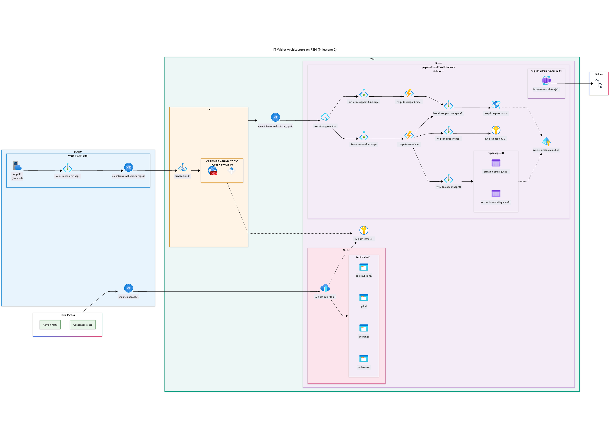

# IO Wallet - Resources

## Work In Progress - Current Status

The diagram below shows the resources actually deployed. This is a work in progress and the diagram will be updated as more resources are added or modified.

<!-- markdownlint-disable -->
<!-- BEGIN_TF_DOCS -->
## Requirements

| Name | Version |
|------|---------|
|  [azuread](#requirement\_azuread) | <= 2.50.0 |
|  [azurerm](#requirement\_azurerm) | ~> 4.0 |
|  [dx](#requirement\_dx) | ~> 0.0 |

## Providers

| Name | Version |
|------|---------|
|  [azurerm](#provider\_azurerm) | 4.54.0 |

## Modules

| Name | Source | Version |
|------|--------|---------|
|  [ids](#module\_ids) | ../../_modules/ids | n/a |

## Resources

| Name | Type |
|------|------|
| [azurerm_resource_group.wallet](https://registry.terraform.io/providers/hashicorp/azurerm/latest/docs/data-sources/resource_group) | data source |

## Inputs

No inputs.

## Outputs

No outputs.
<!-- END_TF_DOCS -->
